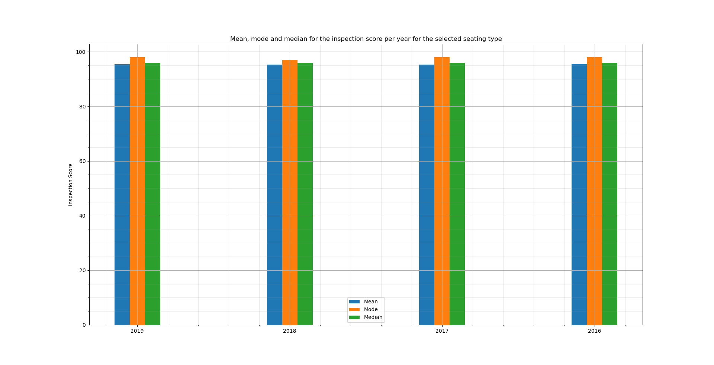
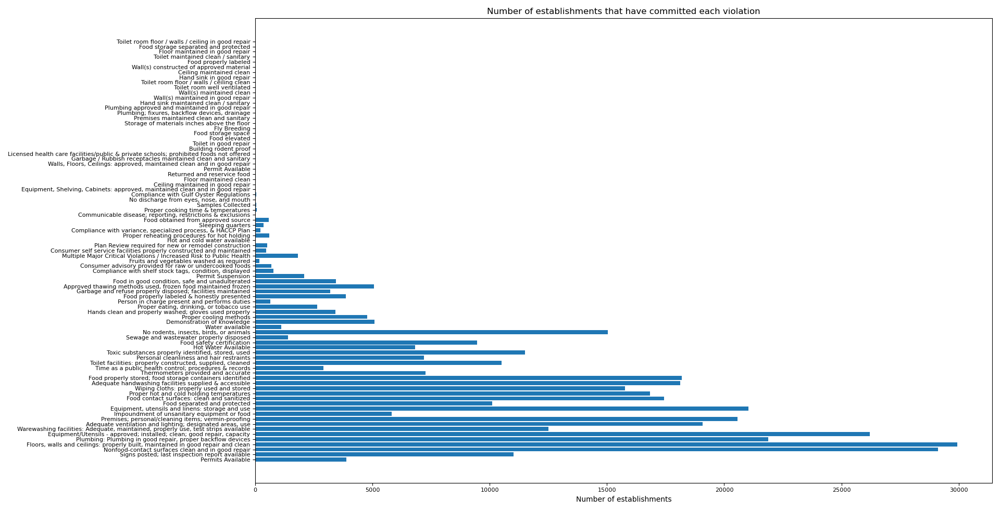
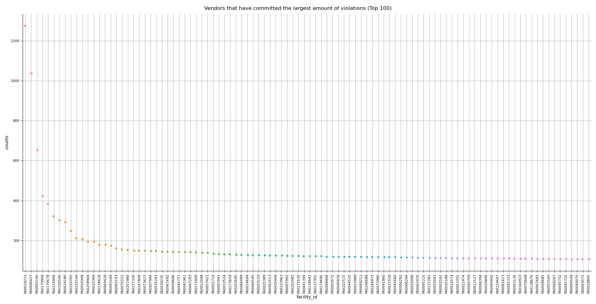

# Kostas' Portfolio

# [Typical MVC Web Application in C#](https://github.com/bebeto1914/MVC_Web_Application)
* Created a CRUD web application using ASP.NET framework using C# language.
* The web application contains 5 scientific questions and their relevant answers, with the end user being able to register and add their own questions and answers in the database.
* Contains Authorization attributes, to disable non-registered users from making any CRUD actions in the database.
* Contains a Search function, to identify scientific answers according to given keywords.
* The app is designed with the Model-View-Controller (MVC) design pattern.
* The View contains code in .cshtml file (Razor), while the Model consists of Classes with their Properties, written in C#. The Controller connects the Model Classes with View and subsequently the end user and handles the web page events, business logic and navigation between pages.

# [Java Coinsorter](https://github.com/bebeto1914/Java_Coinsorter)
* Created a coin denominations application that enables the user to check how many coins of a certain denomination can be exchanged given an input value.
* The application is written in Java programming language and has an intuitive GUI using the Java FX library.
* Part of series of University assignments.

# [Python Data cleansing and analysis tool](https://github.com/bebeto1914/Python_Data_Cleansing_Analysis)
* Created a Data manipulation, visualisation and analysis tool.
* The application takes as input 3 large data sets in .csv format and translates them into .json format, creating the appropriate files respectively.
* Following the steps of the application's GUI, the user can access the visualisation tools that are built-in written with Python's Matplotlib and Seaborn libraries. 
* The data cleansing is achieved using code from Pandas Python library.
* Part of series of University assignments.

